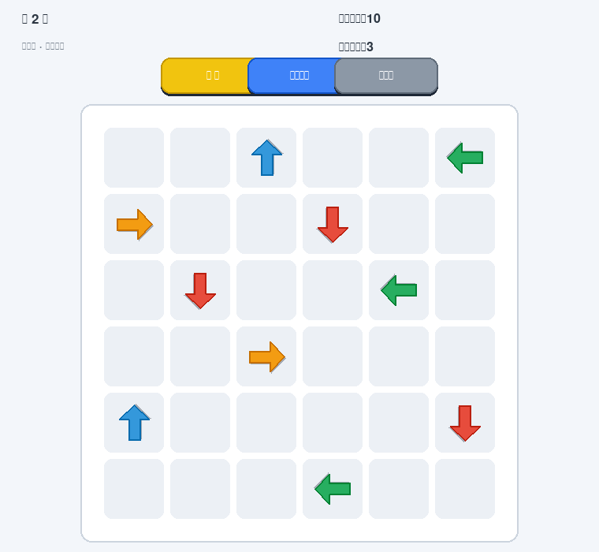
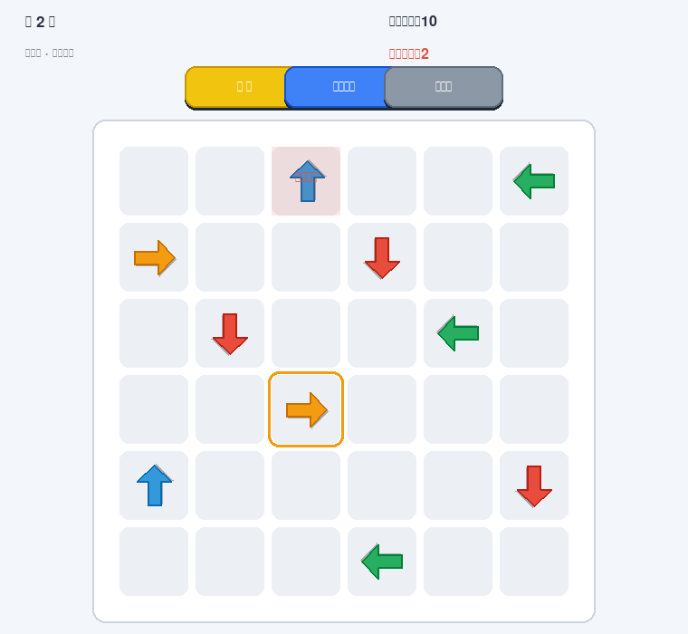
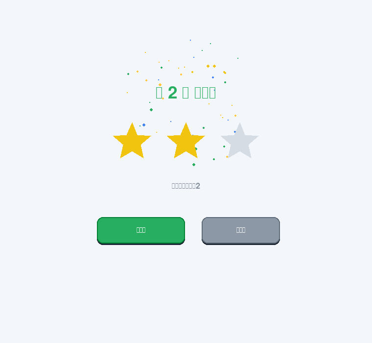
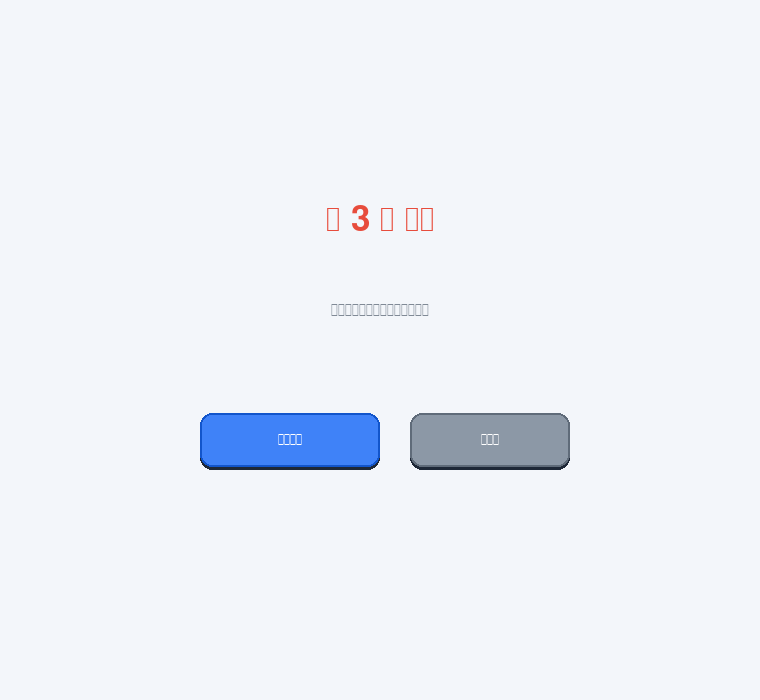

# 一箭又一箭（Arrow Puzzle）

一个使用 **Python + Pygame** 开发的"一箭又一箭"风格箭头解谜小游戏，为软件工程课程作业项目，借助 AIGC 工具（Claude Code）辅助开发。

## 游戏简介

棋盘上分布着上、下、左、右四种方向的箭头。玩家需要观察箭头之间相互阻挡的关系：

- **点击箭头**：若箭头前进方向（同一行/同一列）上、到棋盘边界之间没有其他箭头阻挡，该箭头会**飞出棋盘**并被消除；
- **被阻挡时**：箭头无法飞出，会原地晃动并闪烁红色提示，同时**消耗一次失误机会**；
- **通关条件**：清除棋盘上全部箭头；
- **失败条件**：失误机会（每关 3 次）耗尽。

游戏共 5 个手工设计、经过求解器验证保证可通关的关卡，难度循序渐进。

## 开发环境

| 项目 | 版本 |
| ---- | ---- |
| 操作系统 | Windows 11（跨平台，macOS/Linux 均可运行） |
| Python | 3.10+（开发时使用 3.13.5） |
| pygame | 2.6.1（>=2.5 即可） |
| pillow | 11.1.0（仅生成演示 GIF 时需要） |

## 安装和运行方法

```bash
# 1. 安装依赖
pip install -r requirements.txt

# 2. 运行游戏（项目根目录）
python main.py
```

## 游戏操作说明

| 操作 | 说明 |
| ---- | ---- |
| 鼠标点击箭头 | 前方无阻挡：箭头飞出棋盘；前方有阻挡：晃动 + 红色闪烁，失误次数 -1 |
| `提示` 按钮 | 高亮一支当前可以安全消除的箭头（金色呼吸圈） |
| `重新开始` 按钮 | 当前关卡恢复到初始状态（箭头布局和失误次数全部复原） |
| `主菜单` 按钮 | 返回开始界面 |

界面分为开始界面、游戏界面、通关界面和失败界面。游戏界面顶部显示当前关卡、剩余箭头数量和剩余失误次数；碰撞时还会圈出阻挡你的那支箭头。通关界面按剩余失误机会给出 1~3 星评价。

## 游戏截图

开始界面：


游戏界面（第二关）：



碰撞反馈（箭头晃动 + 红色闪烁 + "被阻挡！"提示，并圈出阻挡箭头）：



通关界面：



失败界面：



第一关自动通关演示：


## 项目结构

```
├── main.py                  # 游戏入口
├── game/
│   ├── config.py            # 窗口/棋盘/颜色/动画参数
│   ├── model.py             # 核心逻辑：Arrow、路径检测、求解器、Game 状态机
│   ├── levels.py            # 5 个关卡数据
│   ├── assets.py            # 中文字体、箭头绘制、程序合成音效
│   ├── ui.py                # Button 控件
│   └── app.py               # 四个场景 + 飞出/碰撞动画 + 主循环
├── tests/
│   └── test_model.py        # 单元测试 T01~T08
├── tools/
│   └── make_screenshots.py  # 无头生成截图与演示 GIF
└── screenshots/             # 截图与 GIF（由工具生成）
```

核心逻辑（[game/model.py](game/model.py)）与界面（[game/app.py](game/app.py)）分离，路径检测、求解器等纯逻辑不依赖 pygame，可以直接单元测试。

## 运行测试

```bash
python -m unittest discover -s tests -v
```

14 个测试用例全部通过，覆盖：四方向路径检测、边界处理、碰撞与失误机制、通关/失败判定、重新开始、以及全部关卡的**可解性验证**（保证每关都存在可行的消除顺序）。

## 声明

- 本项目的代码全部由本人完成，AIGC 工具（Claude Code）用于需求分析、代码生成辅助、关卡验证、调试与文档撰写，具体使用过程见博客；
- 所有箭头、按钮等美术元素均由代码绘制，音效由程序实时合成，未使用任何商业游戏素材；
- 本项目仅参考《一箭又一箭》的核心玩法，未使用原游戏的代码、素材或关卡。

## 致谢

感谢 Claude Code 在开发过程中的协助。
