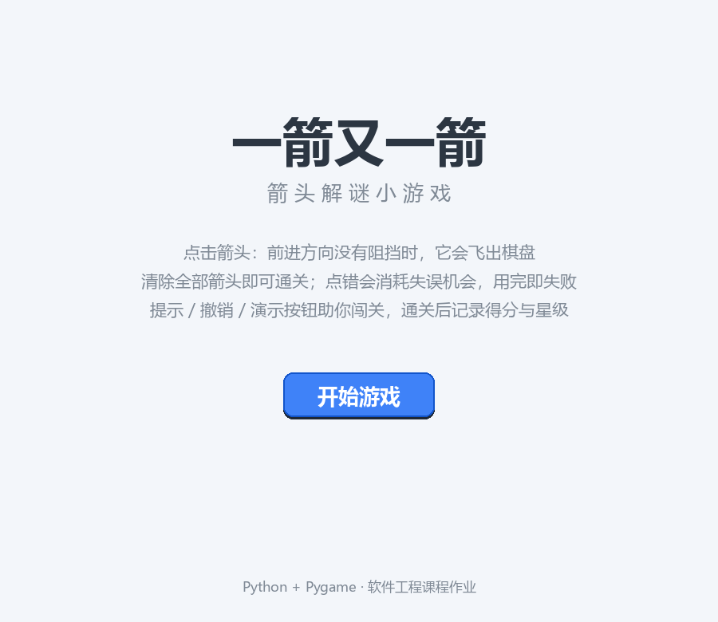
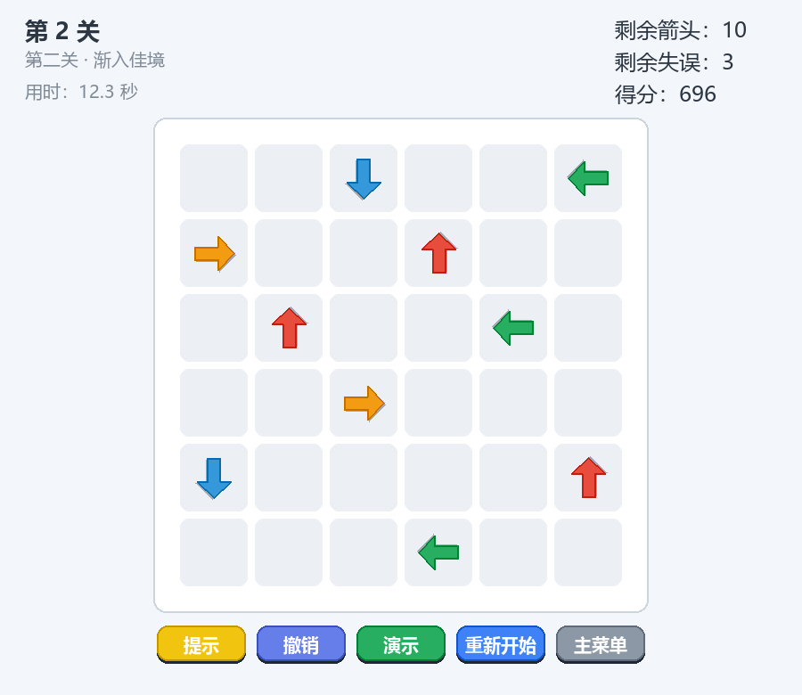
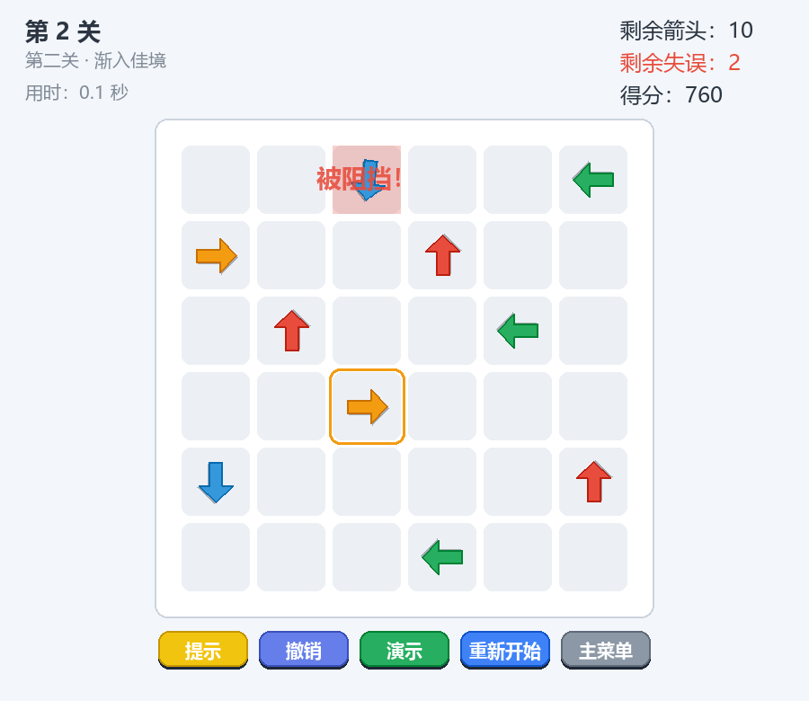
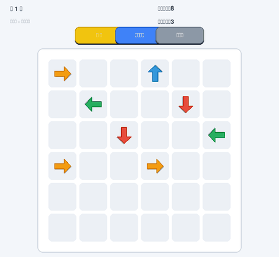

# 软工作业 2：使用 Python 和 AIGC 开发"一箭又一箭"小游戏

| 项目 | 内容 |
| ---- | ---- |
| 这个作业属于哪个课程 | https://edu.cnblogs.com/campus/fzu/2026-01SoftwareEngineeringandSoftwareEngineeringPractice/ |
| 这个作业要求在哪里 | https://edu.cnblogs.com/campus/fzu/2026-01SoftwareEngineeringandSoftwareEngineeringPractice/homework/16718 |
| 这个作业的目标 | 使用 Python 和 AIGC 完成"一箭又一箭"小游戏 |
| 学号 | <学号，待填写> |
| GitHub 仓库 | https://github.com/rohitpyarepur2006-coder/ArrowArrow-Game |

---

## 一、项目展示

开始界面：



关卡选择界面（8 个关卡 + 无尽模式，卡片上显示历史最佳星级与解锁进度）：


游戏界面（顶部 HUD 显示关卡、用时、实时得分、剩余箭头与失误；底部为提示/撤销/演示/重新开始/主菜单按钮）：



碰撞反馈：点击被阻挡的箭头后，箭头原地晃动并摇摆、格子红色闪烁，弹出"被阻挡！"提示，同时圈出阻挡它的那支箭头，失误次数 -1：



通关界面（得分、用时与星级评价）：


失败界面：


第一关自动通关演示 GIF：



## 二、项目介绍

### 游戏规则

棋盘上分布着上、下、左、右四种方向的箭头。玩家点击箭头后，程序检查该箭头前进方向（同一行/同一列）上、箭头与棋盘边界之间是否存在其他箭头：

- 没有阻挡：箭头飞出棋盘并被消除；
- 有阻挡：箭头原地晃动并闪烁红色提示碰撞，消耗一次失误机会；
- 消除全部箭头：通关，进入下一关；
- 失误机会（每关 3 次）耗尽：本关失败，可重新开始。

### 界面设计

程序包含开始界面、游戏界面、通关界面和失败界面四个场景。游戏界面顶部显示当前关卡名、剩余箭头数量和剩余失误次数，并常驻"提示 / 重新开始 / 主菜单"三个按钮。为降低认知负担，四种方向的箭头使用四种颜色（上红、下蓝、左绿、右橙）区分，鼠标悬停在箭头上时单元格会高亮。

### 主要功能和特色

**基础功能**：
- **路径检测**：四方向逐格探测，正确区分"前方阻挡"与"身后箭头"；
- **碰撞反馈**：晃动 + 摇摆 + 红色闪烁 + 浮动文字 + 圈出阻挡箭头，五种提示叠加，一眼看懂为什么点不动；
- **程序合成音效**：飞出、碰撞、通关、失败音效全部由代码实时合成，无任何外部素材；
- **关卡可解性验证**：每个关卡都经过自动化测试确认存在可行消除顺序；
- **纯逻辑与界面分离**：核心逻辑不依赖 pygame，可独立单元测试。

**扩展功能（附加分）**：
- **关卡选择**：8 个关卡 + 选择界面，卡片显示星级与解锁进度，通关推进解锁；
- **得分、计时与星级**：HUD 实时显示用时和得分（消除数 × 50 + 时间奖励 + 剩余失误奖励），通关界面展示成绩并记录历史最佳；
- **提示功能**：内置求解器，高亮一支当前安全的箭头；
- **撤销上一步**：每次点击前压入状态快照，一键撤销（恢复箭头和失误次数）；
- **保存游戏进度**：save.json 自动保存解锁进度、最佳成绩和进行到一半的对局，开始界面提供"继续游戏"；
- **随机生成可通关的关卡**：逆序放置算法保证生成关卡必然可解，作为"无尽模式"无限挑战；
- **AI 自动求解**："演示"按钮让求解器自动演示当前关卡的完整通关步骤；
- **动画与音效**：飞出拖尾 + 旋转 + 粒子爆发，碰撞晃动 + 摇摆 + 红闪；
- **打包 exe**：PyInstaller 一键打包为免环境可执行文件。

## 三、实现思路

### 3.1 箭头的表示

棋盘是 6x6 网格，行号向下增长、列号向右增长。方向用行/列增量元组表示：

```python
UP = (-1, 0)    # 上：行号 -1
DOWN = (1, 0)   # 下：行号 +1
LEFT = (0, -1)  # 左：列号 -1
RIGHT = (0, 1)  # 右：列号 +1

@dataclass(frozen=True)
class Arrow:
    row: int        # 所在行
    col: int        # 所在列
    direction: tuple  # (行增量, 列增量)
```

一个关卡就是 `Level(name, grid_rows, grid_cols, arrows)`，其中 `arrows` 是 `Arrow` 列表；运行时转成 `{(row, col): Arrow}` 字典，按坐标 O(1) 查询。

### 3.2 路径检测：find_blocker

这是整个游戏的核心算法。规则只要求判断同一行/同一列，所以思路很简单：从箭头前方一格开始，沿方向逐格前进，直到越界或遇到第一支箭头：

```python
def find_blocker(board, arrow, grid_rows, grid_cols):
    dr, dc = arrow.direction
    r, c = arrow.row + dr, arrow.col + dc
    while 0 <= r < grid_rows and 0 <= c < grid_cols:
        blocker = board.get((r, c))
        if blocker is not None:
            return blocker   # 最近的阻挡箭头
        r += dr
        c += dc
    return None              # 前方无阻挡，可以飞出
```

两个细节值得注意：

1. **只向前看**：探测从 `arrow.row + dr` 开始，身后的箭头完全不影响判定——例如 `(0,2)→` 左侧有箭头时照样可以飞出；
2. **边界安全**：循环条件 `0 <= r < grid_rows and 0 <= c < grid_cols` 保证位于边缘、朝向棋盘外的箭头直接判为"无阻挡"，不会越界（对应测试 T03）。

### 3.3 状态机：Game

一局游戏的状态用 `Game` 类管理，`click()` 的返回值是枚举 `LaunchResult.FLY_OUT / BLOCKED / NO_ARROW`，界面层根据返回值播放不同动画：

```python
def click(self, row, col):
    arrow = self.board.get((row, col))
    if arrow is None:
        return ClickResult(LaunchResult.NO_ARROW)   # 点空格：无惩罚
    blocker = find_blocker(...)
    if blocker is not None:
        self.mistakes_left -= 1                      # 被阻挡：失误 -1
        if self.mistakes_left <= 0:
            self.status = "failed"
        return ClickResult(LaunchResult.BLOCKED, arrow=arrow, blocker=blocker)
    self.board.pop((row, col))                       # 飞出：立即消除
    if not self.board:
        self.status = "cleared"
    return ClickResult(LaunchResult.FLY_OUT, arrow=arrow)
```

注意：箭头被点击的**瞬间**就从逻辑棋盘移除，飞出画面由界面层的动画特效独立渲染——这样逻辑与动画解耦，也避免"箭头飞出过程中还在阻挡别人"的歧义。

### 3.4 求解器：solve 与关卡可解性

关卡设计最大的坑是"环"：如果 A 挡住 B、B 又挡住 A（例如两支箭头互相指向对方），两支箭谁都飞不出去，关卡就无法通关。为此我实现了贪心求解器：

```python
def solve(level):
    board = level.to_board()
    order = []
    while board:
        free = [a for a in board.values() if find_blocker(board, a, ...) is None]
        if not free:
            return None   # 存在互相阻挡的环，无法通关！
        chosen = free[0]
        board.pop((chosen.row, chosen.col))
        order.append(chosen)
    return order
```

每一步取一支"当前前方无阻挡"的箭头消除。可以证明：只要关卡不存在环，每一步都至少有一支自由箭头，贪心必然成功；反过来如果某一步一支自由箭头都找不到，剩下的箭头必然构成环。这个求解器有三大用途：

1. **关卡验证**：单元测试对全部 5 个关卡运行 `solve`，保证每关都可通关（T07/T08）；
2. **提示功能**：游戏里的"提示"按钮就是返回 `solve` 序列中当前的第一步；
3. **演示脚本**：自动通关 GIF 也是按 `solve` 的顺序点击的。

### 3.5 动画实现

- **飞出**：`FlyingArrow` 记录起点和方向，位置按 `k = 1 - (1 - t/T)^2` 缓动（先快后慢），飞行中整体旋转 180°，身后跟两个逐渐变小的残影形成拖尾，起点处爆发 8 个带重力粒子，最后 40% 路程逐渐淡出；
- **碰撞**：`Collision` 让箭头原地做 `sin(t·55)·7·(1-k)` 的衰减正弦晃动并叠加 ±10° 摇摆，红色半透明闪烁画在**箭头下层**（保证箭头始终清晰可见，不会看起来像"消失"），另有 `FloatText` 上浮淡出文字和橙色脉动圈标出阻挡箭头；
- **通关**：`WinScene` 喷射 50 个带重力的彩色粒子。

箭头图形本身由代码绘制（朝右的底图 + 按方向旋转），音效由代码实时合成（正弦/方波 + 指数衰减包络），全程零外部素材。

### 3.6 随机生成可通关的关卡

无尽模式的关卡由"**逆序放置**"算法生成：按消除顺序的**逆序**逐支放置箭头，放置每支箭头时要求它的正前方路径上没有已放置的箭头。由于已放置的箭头都会在它之后才被消除，新箭头在自己的回合必然能飞出；放置完成时，**放置顺序的逆序就是一条合法的通关顺序**：

```python
def generate_random_level(grid_rows, grid_cols, count, rng):
    placed = {}   # 已放置的箭头
    arrows = []
    for _ in range(count):
        cells = [(r, c) for r in range(grid_rows) for c in range(grid_cols)
                 if (r, c) not in placed]
        rng.shuffle(cells)
        for r, c in cells:
            for d in rng.sample([UP, DOWN, LEFT, RIGHT], 4):
                arrow = Arrow(r, c, d)
                if find_blocker(placed, arrow, grid_rows, grid_cols) is None:
                    arrows.append(arrow)
                    placed[(r, c)] = arrow
                    break
            ...
    return Level("无尽模式", grid_rows, grid_cols, arrows)
```

这个生成器一鱼三吃：单元测试对 20 组随机种子验证了"生成即必可解"的性质；第 6~8 关就是用它配合固定种子生成后人工挑选的；无尽模式则用它实时出题。

### 3.7 撤销、存档与得分

- **撤销**：`Game.click()` 在每次有效点击前把 `(棋盘快照, 失误数, 状态)` 压入历史栈（上限 200 条），`undo()` 弹栈还原。点击空格不产生历史，重新开始会清空历史；
- **存档**：`game/save.py` 用 JSON 保存解锁进度、每关最佳星级/得分、无尽模式最高分以及进行到一半的对局（`mid_level`）。每次有效点击后序列化棋盘（箭头坐标+方向、失误数、用时），开始界面的"继续游戏"据此恢复；打包成 exe 后存档自动改存 exe 所在目录；
- **得分**：`得分 = 消除数×50 + max(0, 600 - 用时×12) + 剩余失误×80`，通关时按失误次数折算 1~3 星，HUD 实时刷新。

## 四、AIGC 使用过程

本次作业使用 **Claude Code**（作业允许列表中的 AIGC 工具）辅助开发。以下 4 次协作过程均来自真实开发记录：

### 记录 1：需求分析与项目结构设计

| 子任务 | 借助何种 AIGC 技术 | AI 实现或提供了什么 | 效果如何 | 人工修改 |
| ------ | ------------------ | ------------------- | -------- | -------- |
| 需求分析与架构设计 | Claude Code | 解析作业文档，梳理功能清单与评分点；设计"纯逻辑层(model) + 界面层(app)"分层结构，并建议用求解器验证关卡可解性 | 结构清晰，核心逻辑可脱离 pygame 直接单元测试，为后面的自动化测试打下基础 | 调整了界面布局参数（HUD 位置、按钮间距）和配色方案 |

### 记录 2：路径检测与碰撞机制

| 子任务 | 借助何种 AIGC 技术 | AI 实现或提供了什么 | 效果如何 | 人工修改 |
| ------ | ------------------ | ------------------- | -------- | -------- |
| 路径检测、碰撞与失误机制 | Claude Code | 实现 `find_blocker` 四方向逐格探测、`Game` 状态机（点击/失误/重置）、以及对应的单元测试 | 基本一次通过；测试覆盖四个方向和"身后箭头不影响"等边界情况 | 补充了四个角落朝向棋盘外的越界测试用例（T03），确认边界处理无误 |

### 记录 3：关卡设计与可解性验证

| 子任务 | 借助何种 AIGC 技术 | AI 实现或提供了什么 | 效果如何 | 人工修改 |
| ------ | ------------------ | ------------------- | -------- | -------- |
| 关卡设计 | Claude Code | 生成 5 个 6x6 关卡布局、贪心求解器 `solve` 和可解性测试（T07/T08） | **自动化测试发现第 3/4/5 关存在互相阻挡的环，无法通关**（例如第 4 关 `(0,4)↓` 与 `(3,4)↑` 在中间的箭头被消除后面面对互指） | 逐关分析卡住的箭头集合，调整三处箭头方向打破环，复测全部通过；5 关逐一试玩确认 |

这次经历让我深刻体会到：**关卡数据不能拍脑袋设计，必须机器验证**。肉眼很难发现"消除到一半才出现的环"，而求解器一步就能定位。

### 记录 4：界面动画与演示素材

| 子任务 | 借助何种 AIGC 技术 | AI 实现或提供了什么 | 效果如何 | 人工修改 |
| ------ | ------------------ | ------------------- | -------- | -------- |
| 动画、音效与截图工具 | Claude Code | 实现四个场景的状态机、飞出/碰撞/粒子特效、程序合成音效、无头截图与 GIF 生成脚本 | 基本可用；调试中发现两个问题：① 碰撞截图的场景对象未切换到截图工具；② PIL 保存 GIF 时"与前一帧相同的帧"会被合并 | 修复场景切换 bug；确认 GIF 帧合并是 PIL 的优化行为（时长会累加到上一帧），播放节奏不受影响，保留该行为 |

### 记录 5：扩展功能开发（附加分）

| 子任务 | 借助何种 AIGC 技术 | AI 实现或提供了什么 | 效果如何 | 人工修改 |
| ------ | ------------------ | ------------------- | -------- | -------- |
| 关卡选择/得分/撤销/存档/随机生成/AI 演示/打包 | Claude Code | 设计并实现关卡选择界面、得分计时公式、撤销历史栈、save.json 存档、逆序放置随机生成算法、"演示"自动求解按钮、PyInstaller 打包脚本；补充对应单元测试 | 新增 20 个测试全部通过；冒烟测试覆盖选择→通关→撤销→演示→无尽→断点续玩→失败全流程；打包出可独立运行的 exe | 用固定种子挑选第 6~8 关布局并逐一试玩；得分公式的边界用例（未消除任何箭头时得分下限）在测试中发现与预期不符，修正测试断言并确认公式行为合理 |

## 五、测试结果

采用**自动化测试**（`python -m unittest discover -s tests -v`），共 34 个用例，覆盖作业要求的全部测试项：

| 编号 | 测试内容 | 预期结果 | 实际结果 | 是否通过 |
| ---- | -------- | -------- | -------- | -------- |
| T01 | 点击前方无阻挡的箭头 | 箭头飞出棋盘并消失 | 箭头从棋盘移除，状态正确 | ✅ 通过 |
| T02 | 点击前方有阻挡的箭头 | 箭头不消失，失误次数减 1 | 箭头保留，失误 -1，返回阻挡者 | ✅ 通过 |
| T03 | 点击位于边缘且朝向棋盘外的箭头 | 箭头正常消失，不发生越界错误 | 四角 6 种组合全部正常飞出 | ✅ 通过 |
| T04 | 消除本关全部箭头 | 显示通关并进入下一关 | 状态变为 cleared，剩余 0 | ✅ 通过 |
| T05 | 失误次数耗尽 | 显示失败并允许重新开始 | 状态变为 failed，失误归零 | ✅ 通过 |
| T06 | 游戏进行中重新开始 | 箭头布局和失误次数恢复 | 布局与失误次数完全复原 | ✅ 通过 |
| T07 | 每个关卡存在通关顺序 | 8 个关卡全部可解 | 求解器为每关找到完整消除顺序 | ✅ 通过 |
| T08 | 求解序列逐步合法性 | 每步点击的箭头当时均无阻挡 | 逐步模拟全部合法，最后清空 | ✅ 通过 |
| T09 | 撤销上一步 | 恢复被消除的箭头和已消耗的失误 | 碰撞后撤销恢复失误，飞出后撤销恢复箭头 | ✅ 通过 |
| T10 | 撤销边界情况 | 无历史时撤销返回失败；空格点击不产生历史 | 行为符合预期 | ✅ 通过 |
| T11 | 随机生成关卡可解 | 任意种子生成的关卡都有通关顺序 | 20 组随机种子全部可解，箭数正确 | ✅ 通过 |
| T12 | 得分计算 | 用时越短、失误越少得分越高，且非负 | 各边界用例符合预期 | ✅ 通过 |
| T13 | 存档读写 | 保存后能完整读回，缺文件/损坏时回退默认 | 读写往返一致，容错正常 | ✅ 通过 |
| 附加 | 互相阻挡的环（A↔B） | 求解器判定不可解 | 正确返回无解 | ✅ 通过 |
| 附加 | 点击空格 | 不消耗失误机会 | 无惩罚，状态不变 | ✅ 通过 |
| 附加 | 扩展功能冒烟测试 | 关卡选择→通关→撤销→AI 演示→无尽模式→断点续玩→失败全流程正常 | 全部通过（含存档恢复） | ✅ 通过 |

另外完成了手工测试：8 个关卡逐一实机试玩，确认难度递进合理、动画流畅、按钮功能正常（运行 `python main.py` 即可复现）。

## 六、PSP 表格

| 任务 | 预估耗时（小时） | 实际耗时（小时） | 差异（小时） |
| ---- | ---------------- | ---------------- | ------------ |
| 需求分析与游戏设计 | 1.0 | 0.8 | -0.2 |
| Python 与图形库学习 | 2.0 | 0.5 | -1.5 |
| 游戏界面实现 | 4.0 | 3.0 | -1.0 |
| 路径与碰撞逻辑实现 | 3.0 | 2.5 | -0.5 |
| 关卡设计 | 1.5 | 2.0 | +0.5 |
| 扩展功能开发 | 4.0 | 4.5 | +0.5 |
| AIGC 辅助开发 | 3.0 | 4.5 | +1.5 |
| 测试与修改 | 2.0 | 2.5 | +0.5 |
| README 与博客撰写 | 2.0 | 2.0 | 0 |
| 合计 | 22.5 | 22.3 | -0.2 |

说明：与预估相比，"Python 与图形库学习"大幅缩短（AIGC 直接给出可运行的示例代码，学习成本降低）；"扩展功能开发"和"AIGC 辅助开发"超出预估，主要花在反复迭代修复关卡中的环、扩展功能的多轮设计调整，以及调试截图/动画等细节问题上——这也说明 AIGC 生成的内容必须经过验证才能使用。

## 7. 心得体会

这次作业最大的收获有四点：

1. **AIGC 改变了"从零开始"的学习方式，但验证责任在自己**。AI 帮我快速搭起 pygame 的界面框架、生成路径检测代码，我不再需要先啃完文档再动手；但 AI 生成的关卡数据里藏着三处"互相阻挡的环"，如果没有自动化验证，交上去的会是一个无法通关的游戏。**"AI 生成 → 测试验证 → 人工修改"**的循环才是正确用法。

2. **好的架构让测试变得自然**。把路径检测、状态机、随机生成等纯逻辑放进不依赖 pygame 的 `model.py`，单元测试就可以直接覆盖全部游戏规则；而界面层只管"根据返回值播动画"。扩展功能开发时，撤销栈、得分公式、存档读写都能在纯逻辑层先行测试，界面只是薄薄一层。

3. **求解器一鱼三吃**。一个贪心求解器同时服务于关卡可解性验证、游戏内"提示"按钮、"演示"自动通关和自动演示 GIF，让我体会到"写一段代码解决多个问题"的乐趣——这其实也是"消除问题"本身的拓扑排序思想。

4. **"逆序放置"是这次最有趣的算法**。随机生成关卡时，如果先想"怎么生成"很容易陷入"生成完还要验证可解"的困境；换个方向——按消除顺序的逆序放置、每步保证路径干净——可解性就变成了构造本身的副产品。先想清楚"解应该长什么样"，再反过来构造题目，这个思路值得记住。

不足与展望：无尽模式的难度还没有分级（箭数随机 12~18），可以按连续通关数递增箭数；动画方面可以加入连击特效；博客中的 PSP 数据为开发过程的估算，实际数值以个人记录为准。
